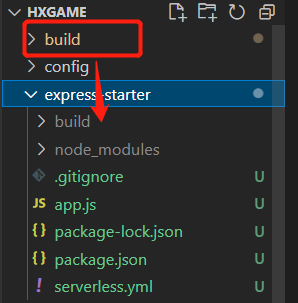
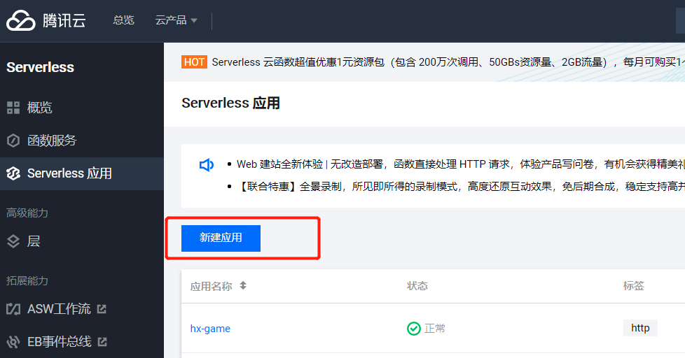
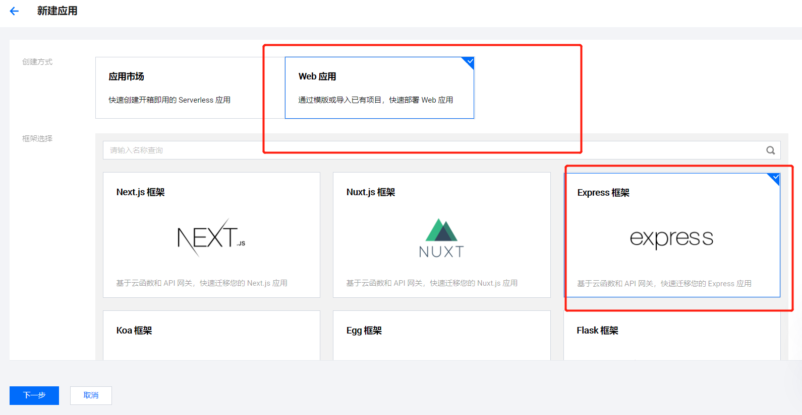
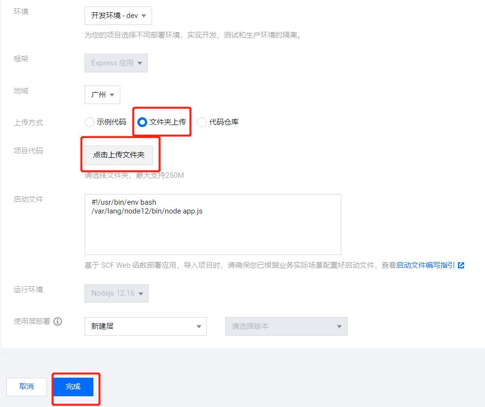

## HXGAME

## 介绍
基于 乾坤 + iframe 的微前端架构，无视框架，收集各种前端小游戏，并把它们整合到一起。主应用则是基于 react + react-router-dom 搭建开发。
<a href="https://service-1fpayfkw-1302167662.gz.apigw.tencentcs.com/release/">游戏在线地址</a>

## 启动项目
```shell
yarn start
or
npm start
```

## 打包项目
```shell
yarn build
or
npm run build
```

## 部署项目
基于 serverless 无服务化部署项目，之前本来想用 serverless 指令部署到腾讯云的 Serverless。但现在 serverless 指令好像被 aws 接管了（aws的注册还要绑定海外账户）。所以只能通过编写 serverless 应用模板，直接将文件夹提交到腾讯云的 Serverless。
步骤如下：
#### 1、打包后，将打包的代码移入 express-starter 文件夹中


#### 2、登录腾讯云新建应用


#### 3、选择 express 模板，上传我们的 express-starter 文件夹，最后点击完成创建应用即可




